  

<h1 align="center">Hi, I'm Gabriel Espínola 👋</h1>

  <strong>Data Engineer</strong> • Python & SQL • ETL • Data Quality • Monitoring • Big Data

---

## 🚀 About Me

I'm a **Data Engineer** focused on building reliable and scalable **data pipelines**.  
I work mainly with **Python and SQL**, transforming raw data into analytics-ready datasets while ensuring data quality and consistency.

---

## 🔄 What I Work On

- Data ingestion from APIs, databases and files  
- ETL / ELT pipeline development  
- Data quality checks and monitoring  
- Batch data processing  
- Supporting analytics and reporting needs  

---

## 🛠️ Tech Stack

- **Languages:** Python, SQL  
- **Data Engineering:** ETL pipelines, automation, data validation  
- **Big Data:** Spark  
- **Databases:** PostgreSQL  
- **Cloud:** Google Cloud Platform (GCS, BigQuery)  
- **Tools:** Git, Linux  

---

## 📂 Featured Repositories

This profile includes projects related to:

- Data pipeline implementations  
- Data quality & monitoring scripts  
- Analytics-ready datasets  
- Academic and practical data engineering projects  

Each repository contains documentation explaining the problem, approach and solution.

---

## 🎯 Current Focus

- Designing more robust and scalable data pipelines  
- Improving Big Data processing skills  
- Deepening Cloud Data Engineering knowledge  

---

## 📫 Contact

- 📧 **Email:** gespinolabenitez@gmail.com  
- 🔗 **LinkedIn:** *www.linkedin.com/in/gabriel-espinola*  

---

Thanks for visiting my profile 🚀
